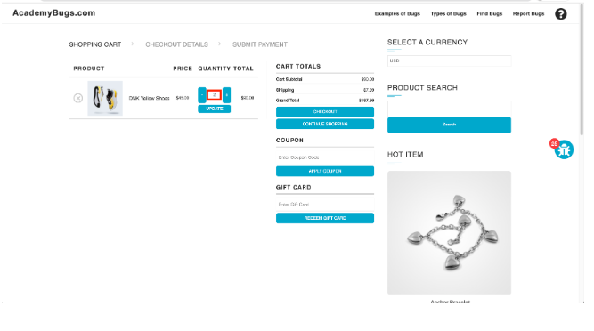

# 🐞 Баг 18 Количество товара не может быть увеличено больше 2

**Тип бага:**  Функциональный
**Приоритет:**  Высокий

---

### ✅ Ожидаемый результат

Количество товара может быть увеличено более чем на 2
---

### ❌ Фактический результат

При нажатии на кнопку обновления количество товаров снова становится 2

---

### 🔁 Шаги воспроизведения

1. Открыть https://academybugs.com
2. Нажать на ссылку "Find Bugs" на панели навигации
3. Добавить один или несколько товаров в корзину
4. Нажать на ссылку "View Cart" в верхней части страницы
5. Установить количество товара 3 или более
6. Нажать "Update" ниже
---

### 💻 Среда

- Браузер: Chrome / Firefox / Safari
- Устройство: ПК / Мобильный
- ОС: Windows / macOS / Android / iOS

---

### 📸 Скриншот

