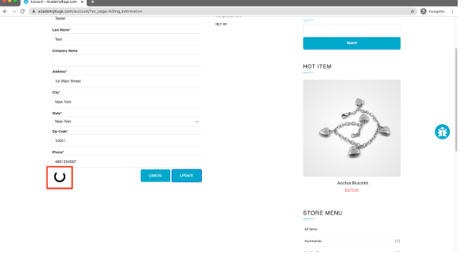

# 🐞 Баг 21 Платежная информация не обновляется

**Тип бага:**  Производительность
**Приоритет:**  Высокий

---

### ✅ Ожидаемый результат

Платежная информация обновляется после заполнения формы и нажатия кнопки "Update"

---

### ❌ Фактический результат

Платежная информация загружается бесконечно после заполнения формы и нажатия кнопки "Update"

---

### 🔁 Шаги воспроизведения

1. Открыть https://academybugs.com
2. Нажать на ссылку "Find Bugs" на панели навигации
3. Открыть товар
4. Нажать "Sign Up" в нижней части правого меню
5. Зарегистрироваться с фейковыми данными если вы не зарегистрированы. В противном случае введите свои учетные данные и войдите в систему
6. В нижней части правого меню выбрать пункт "Billing Information"
7. Заполнить форму платежной информации
8. Нажать "Update"

---

### 💻 Среда

- Браузер: Chrome / Firefox / Safari
- Устройство: ПК / Мобильный
- ОС: Windows / macOS / Android / iOS

---

### 📸 Скриншот

